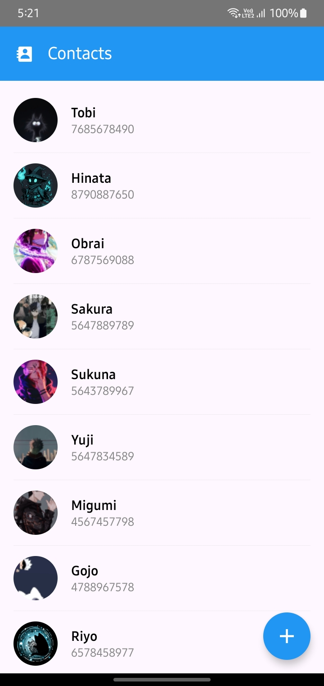
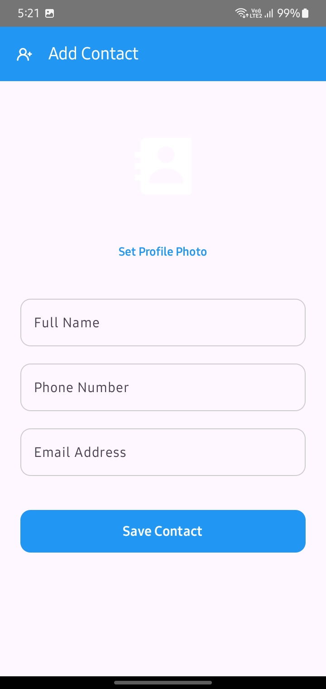
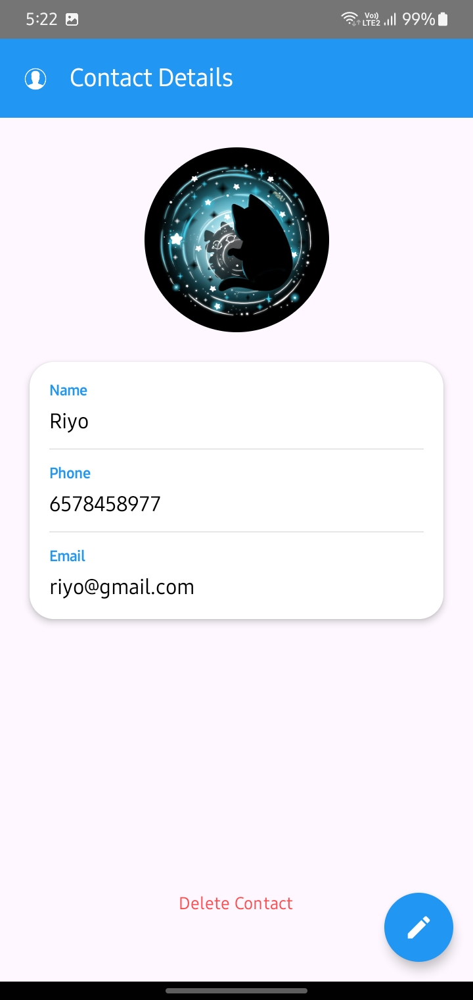
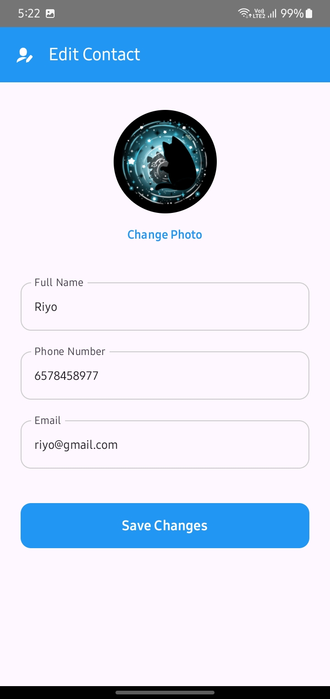

# ContactPro 📇

ContactPro is a simple Android app to manage your contacts. It works offline, so you can use it anytime without internet. I built this app using Jetpack Compose and Room Database to learn modern Android development.
---

🏗 Architecture (MVVM)

I used MVVM architecture to keep the code clean and easy to understand:

* data.local: Stores data using Room Database (contacts are saved here).
* data.repository: Connects the database with the rest of the app.
* viewmodel: Handles data and UI state.
* presentation: UI part built using Jetpack Compose.
---

🚀 Features
* Save contacts offline (no internet needed)
* Add, edit, and delete contacts
* Data updates automatically on screen
* Load contact images smoothly
* Simple and clean UI
---

🛠 Tech Stack
Language: Kotlin
UI: Jetpack Compose
Database: Room
Architecture: MVVM
Concurrency: Coroutines & Flow
Image Loading: Coil
---

📸 Preview
   

📥 Getting Started

1.Clone the repository:

</>Bash
git clone https://github.com/Anisha956/ContactPro.git

2.Open in Android Studio

3.Run the app on emulator or phone
